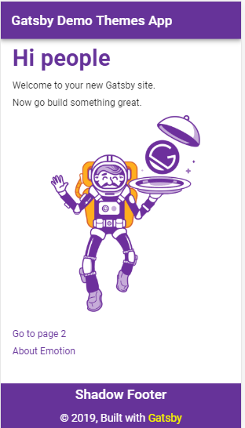
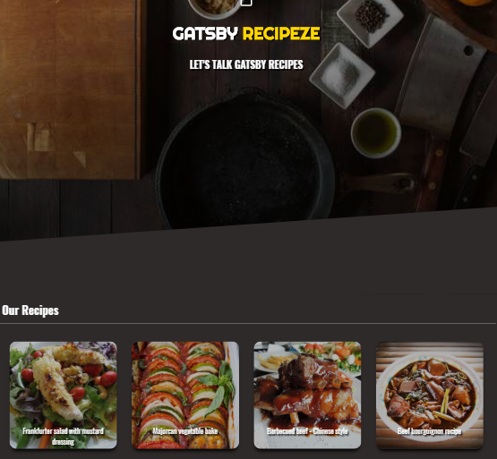
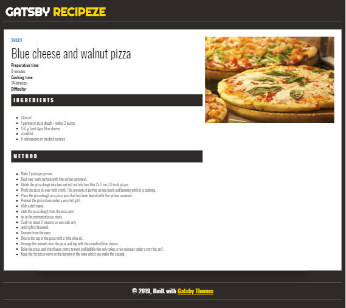
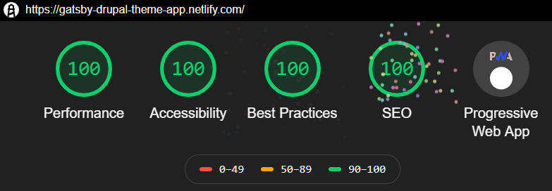

# gatsby-atomic-themes

This project is about exploring the new feature from Gatsby called `Themes`. A detailed POV is also available [here](https://medium.com/@tksukhu/scale-your-gatsbyjs-infrastructure-with-gatsby-themes-f19654e3c0d0).

## Objective

The idea is the explore the possibility to break down the gatsby site creating into the smallest maintainable atomic component or components so that there is a clear separation of concerns from the project configuration to the actual application being built. 

This project demonstrates the following
- Building themes catering to different use case: 
	1) `Core Infrastructure` - Core Gatsby Infrastructure pieces like SEO, Image Optimization, Analytics
	2) `Component Libraries` which are part of the Gatsby infrastructure - Material-UI and Emotion Component Libraries
	3) `Template Libraries` these are component libraries which also include page templates for a specific use case - Material-UI and Emotion Component Libraries
	4) `Pre-configured libraries`, plugins and setup components - Material-UI, Emotion JS , Drupal
	5) `Extendability and Atomic themes` which can build on top of other themes either by composition or extension of other themes.
	6) `Shadowing Components` - while we extend themes , but still have the ability to override or customize components that are derived from themes
	7) `Separation of concerns using shadowing` - exciting and un-documented feature of being able to separate GraphQL queries from the implementation using component shadowing.

## Demo

The demo sites built using this monorepo are available

- Simple Site which mimics the basic Gatsby Starter plus uses the `core` & `mui` is available [here](https://gatsby-atomic-themes.netlify.com/). The source for the same is the [site App](./site)
	


- A main showcase app called `GATSBY RECIPEZE` is a Drupal site which depicts all the above mentioned uses cases is available [here](https://gatsby-drupal-theme-app.netlify.com/)




## Structure

1. Yarn workspaces used so that we are able to maintain the Gatsby infrastructure pieces as atomic themes all in one place. This also gives us the ability to see the changes like using the application workspaces without having to go through the entire process of publishing the npm module and then testing whether it works.

2. Themes:

### Gatsby Core Theme

- Name: `@gatsby-themes/core`
- Usecase(s): `Core Infrastructure`
- The core theme sets up the base configuration.
- The idea is to have the SEO, image processing, file source setup , PWA, core branding of the product in one place and versioned
- Sites can simply use the not worry about setting this piece properly and any changes to the core configuration can be done via the theme.
- All organization specific core plugins , icons can be configured here.

### Gatsby Material-UI Theme

- Name: `@gatsby-themes/mui`
- Usecase(s): `Component Libraries`,`Pre-configured libraries`
- The mui theme sets up the configuration based on the best practices recommended by the material-ui team.
- This takes care of all the setup and configuration requirements for theming, layouts, material-ui setup for SSR and client side rendering.
- An HOC sets up the material-ui theming both for SSR and Browser modes, so the user just needs to configure the material-ui theme configuration to customize it to the websites requirements.
- Also provides few sample UI components - Header , Footer

### Gatsby Emotion Theme

- Name: `@gatsby-themes/emotion`
- Usecase(s): `Component Libraries`,`Pre-configured libraries`
- The emotion theme sets up the configuration based on the best practices recommended by the [Gatsby team](https://www.gatsbyjs.org/docs/emotion/)
- This takes care of all the setup and configuration requirements for theming, layouts and setup.
- This uses `theme-ui` as the theming style system
- This also is a core / component UI library of EmotionJS components. As an example a sample UI component has been added called `About`

### Gatsby Recipe Emotion Theme

- Name: `@gatsby-themes/emotion-recipe-theme`
- Usecase(s): `Component Libraries`,`Pre-configured libraries`,`Extendability and Atomic themes`,`Template Libraries`
- The receipe theme is theme that extends the `@gatsby-themes/emotion` theme and provides a UI component library and templates for building recipe pages.
- The components are based on the atomic design priciples and can be used to build applications which require the recipe theme.

### Gatsby Drupal Theme

- Name: `@gatsby-themes/drupal`
- Usecase(s): `Pre-configured libraries`,`Separation of concerns using shadowing`
- The drupal theme sets up the configuration for drupal
- This is also based on the Gatsby DEMO Drupal CMS site for recipes
- It takes care of not only the drupal gatsby plugin configuration but also sets up all the queries that are needed for the building the recipe app.
- Currently there are two template page queries available
	1) [Landing Page Query](https://github.com/ERS-HCL/gatsby-atomic-themes/blob/master/packages/drupal-theme/src/templates/index.js) - List of all the recipes
	2) [Recipe Template Page Query](https://github.com/ERS-HCL/gatsby-atomic-themes/blob/master/packages/drupal-theme/src/templates/recipe.js) - Specific Recipe details based on the id
- `Separation of GraphQL Queries from the component rendering`
	- In the application that use ising this theme , implement the two template pages as shadow components (Index , Recipe as mentioned above).
	- The data queries (GraphQL queries) will be provided this theme
	- Only implement the Page rendering logic in the application (The data object from the shadows templates will be avaiable to use)
		- See the example templates in the [drupal-app](https://github.com/ERS-HCL/gatsby-atomic-themes/tree/master/packages/drupal-app) for more details.


### Material-UI & Emotion Demo App

- Name: `demo-app`
- Usecase(s): `Shadowing Components`,`Extendability and Atomic themes`

Demo application based on Gatsby Themes that mimics the Gatsby Starter plus uses the core, material-ui (mui) and emotion themes to demonstrate composition and component shadowing.

### Showcase Drupal App
- Name: `drupal-app`
- Usecase(s): `Shadowing Components`,`Extendability and Atomic themes`

This is the main showcase application based on based on Gatsby Themes, Drupal and Emotion. This leverages all the above mentioned themes and uses all the theme concepts.
This application also has got 100% results in Lighthouse and this demo site is PWA enabled.



For more information please see the respective README files of each project under this workspace.

## Running the Application(s)

### Material-UI & Emotion Demo App

```bash
yarn workspace demo-app develop
```

### Showcase Drupal App

```bash
yarn workspace drupal-app develop
```

## Storybook

Each of the component library projects (mui, emotion, emotion-recipe-theme) are also integrated with storybook as part of the infrastructure.

### MUI

```bash
yarn workspace @gatsby-themes/mui storybook
```

### Emotion

```bash
yarn workspace @gatsby-themes/emotion storybook
```

### Emotion Recipe

```bash
yarn workspace @gatsby-themes/emotion-recipe-theme storybook
```

## External Application Test

While the workspace is fine , but we need to make sure the themes work outside the workspace and can be used as part of an external gatsby site. For this a Gatsby application is created in the folder `site` is created outside the workspace. This depends on the `@gatsby-themes` packages that are published on npm. All we need to do is to add the dependencies for these packages as well as the peer dependencies which they depend on.

In order to run the external Gatsby site

```bash
cd site
yarn
yarn develop
```

## Gatsby Themes NPM Page

The themes are published here https://www.npmjs.com/search?q=%40gatsby-themes

## LICENSE

MIT
